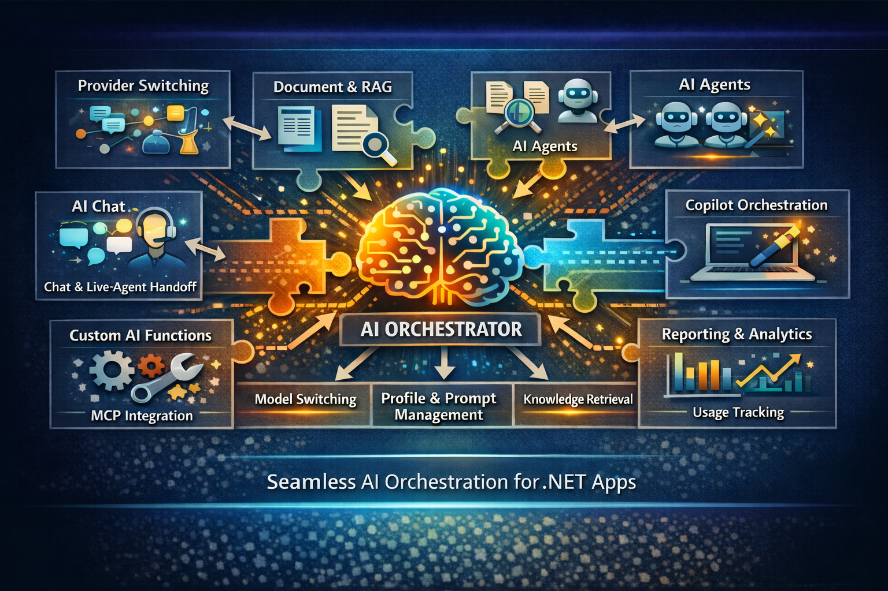

# CrestApps.Core



**CrestApps.Core is a composable AI management and application framework for .NET.** It gives you the building blocks to ship AI chat, agents, RAG, document workflows, MCP, A2A, reporting, and custom AI tooling without stitching together a pile of disconnected provider SDK samples.

## Why it exists

Most teams start AI integration with a provider SDK, then quickly run into the real complexity:

- Model and provider switching
- Prompt and profile reuse
- Chat session management
- Document and knowledge retrieval
- Tool calling and custom functions
- Reporting, consumption tracking, and lead workflows
- Live-agent handoff and post-session automation
- Protocol integration like MCP and A2A
- Orchestrator integration like GitHub Copilot orchestration.

`CrestApps.Core` packages that complexity into reusable .NET services so you can move faster, keep control of behavior, and ship AI features with less custom plumbing.

## What you get

- **AI management** for connections, deployments, agent profiles, data sources, templates, MCP resources, prompts, and external hosts
- **Reusable AI agent profiles** so every session can start with predefined behavior, settings, tools, prompts, and retrieval rules
- **Chat interactions** for provider-agnostic playground and production chat experiences
- **Document upload and processing** for summarization, Q&A, extraction, tabulation, and knowledge workflows
- **RAG support** across attached documents, search indexes, and user memory, including configurable preemptive RAG
- **AI agents** with agent-to-agent handoff through A2A
- **MCP server and MCP client capabilities** including resource, prompt, and external host management
- **Custom AI functions** for application-specific actions and tool calling
- **Copilot orchestrator integration**
- **Claude orchestrator integration**
- **Template-driven prompts and profile definitions** for cleaner code and reusable system behavior
- **Chat widgets and business workflows** including chat metrics, data extraction, goal conversion, post-session processing, and live-agent handoff
- **Usage and lead reporting** for AI consumption and customer engagement scenarios
- **AI memory** for more personal, user-aware experiences
- **Full customization** from code-level extension points to default runtime behavior

## Common use cases

- **Lead generation chat** on a marketing site that qualifies visitors, captures contact details, and routes hot leads by email or workflow
- **Knowledge-base assistants** restricted to approved business content stored in documents, Elasticsearch, or Azure AI Search
- **Support automation** that starts with AI and escalates to a live agent on a third-party platform when needed
- **Specialized agent teams** where multiple AI agents handle different tasks and coordinate through A2A
- **Document analysis workbenches** for reports, contracts, internal documentation, or uploaded files
- **Reusable internal copilots** for operations, sales, research, and support teams
- **Custom workflow automation** driven by AI tool calls into your own services and APIs

See the full use-case guide at **[core.crestapps.com](https://core.crestapps.com)**.

## Fastest way to try it

```powershell
git clone https://github.com/CrestApps/CrestApps.Core.git
cd CrestApps.Core
dotnet build .\CrestApps.Core.slnx -c Release /p:NuGetAudit=false
dotnet test .\tests\CrestApps.Core.Tests\CrestApps.Core.Tests.csproj -c Release /p:NuGetAudit=false
dotnet run --project .\src\Startup\CrestApps.Core.Mvc.Web\CrestApps.Core.Mvc.Web.csproj
```

The MVC sample is the quickest way to see the full stack working together: AI connections, deployments, agent profiles, Chat Interactions, document processing, MCP, A2A, storage, and SignalR.

## Fastest way to consume it

Install the smallest useful package set for your app:

```xml
<ItemGroup>
  <PackageReference Include="CrestApps.Core" />
  <PackageReference Include="CrestApps.Core.AI" />
  <PackageReference Include="CrestApps.Core.AI.Chat" />
  <PackageReference Include="CrestApps.Core.AI.OpenAI" />
</ItemGroup>
```

Register the shared services plus one provider and the playground-style chat UI:

```csharp
builder.Services.AddCrestAppsCore(crestApps => crestApps
    .AddAISuite(ai => ai
        .AddOpenAI()
        .AddChatInteractions()));
```

By default, provider connections are loaded from `CrestApps:AI:Connections` and standalone deployments are loaded from `CrestApps:AI:Deployments`:

```json
{
  "CrestApps": {
    "AI": {
      "Connections": [
        {
          "Name": "primary-openai",
          "ClientName": "OpenAI",
          "ApiKey": "YOUR_API_KEY"
        }
      ],
      "Deployments": [
        {
          "Name": "gpt-4.1",
          "ClientName": "OpenAI",
          "ModelName": "gpt-4.1",
          "Type": "Chat"
        }
      ]
    }
  }
}
```

From there, create your first AI profile and use **Chat Interactions** as the easiest playground-style UI to chat against that profile while you tune prompts, providers, and deployments.

## Learn more

- **Documentation:** <https://core.crestapps.com>
- **Issues:** <https://github.com/CrestApps/CrestApps.Core/issues>
- **Preview feed:** <https://cloudsmith.io/~crestapps/repos/crestapps-core>
- **Preview source URL:** `https://nuget.cloudsmith.io/crestapps/crestapps-core/v3/index.json`

## Repository layout

```text
src/
├── Abstractions/
├── Primitives/
├── Resources/
├── Stores/
├── Utilities/
├── Startup/
│   ├── CrestApps.Core.Aspire.AppHost/
│   ├── CrestApps.Core.Mvc.Web/
│   ├── CrestApps.Core.Mvc.Samples.A2AClient/
│   └── CrestApps.Core.Mvc.Samples.McpClient/
└── CrestApps.Core.Docs/

tests/
└── CrestApps.Core.Tests/
```

## Community

This project is actively evolving to help the .NET community adopt AI with strong architecture, extensibility, security-minded defaults, and support for modern protocols. If it helps you, please open issues, share feedback, report bugs, star the repository, or contribute code.

## License

MIT
